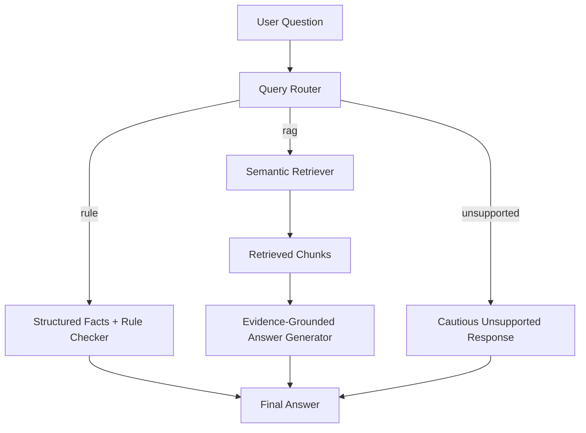
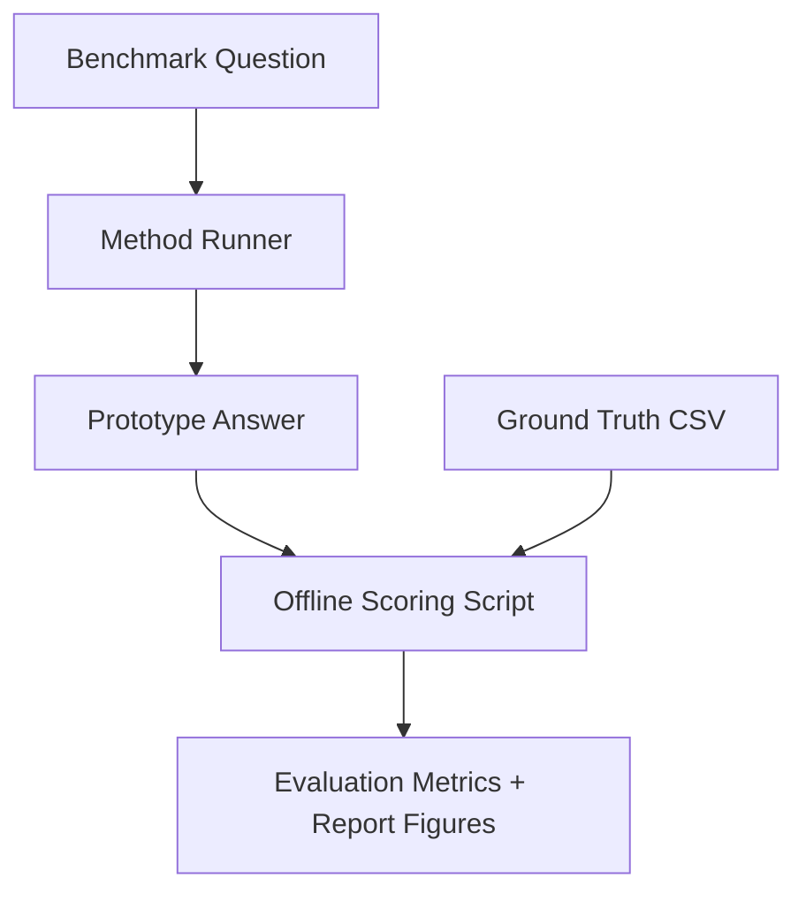

# AI-Powered Academic Document Assistant

## Overview
This repository contains a hybrid AI prototype for Assessment 3 of `36121 Artificial Intelligence Principles and Applications`.

The prototype is designed to help students interpret academic assessment documents by combining:

- structured knowledge representation for exact facts
- rule-based reasoning for deterministic constraints
- semantic retrieval for document evidence
- evidence-grounded answer generation for open-ended questions
- an evaluation pipeline that produces report-ready quantitative results and figures

The current version is intentionally shaped to support a stronger HD-level report. In addition to factual assignment questions, it now covers rubric interpretation, system design explanation, workflow questions, evaluation design questions, and cautious handling of unsupported requests.

## What The Prototype Can Now Support
- Exact assessment constraints such as due dates, word limits, similarity limits, file formats, filenames, presentation timing, and submission responsibilities.
- HD-oriented rubric questions for report sections and presentation criteria.
- Report-writing questions about AI methods, the system pipeline, exact-vs-open-ended answering strategy, and evaluation design.
- Unsupported or unsafe questions with explicit caution rather than fabricated answers.
- Empirical evaluation artefacts for the report, including summary tables, category breakdowns, failure cases, and charts.

## Architecture
The implementation is split into clear modules:

1. `src/chunking.py`
   Builds deterministic text chunks with section and category metadata.
2. `src/query_router.py`
   Routes each question to `rule`, `rag`, or `unsupported`.
3. `src/rule_checker.py`
   Answers exact questions from `data/processed/structured_facts.json`.
4. `src/retrieval.py`
   Retrieves evidence chunks with embeddings, lexical overlap, and category boosts.
5. `src/answer_generator.py`
   Produces grounded answers through an OpenAI-compatible LLM when available, with deterministic fallbacks when quota or provider access is unavailable.
6. `src/baselines.py`
   Provides `Keyword Search`, `RAG-only`, and optional `LLM-only` baselines.
7. `evaluation/evaluate.py`
   Runs the benchmark suite and saves report-ready CSV files and figures.

Every function in the maintained Python modules includes English docstrings so developers can follow the architecture quickly.

## Runtime Document Collection
The live prototype currently uses these source documents in `data/raw/`:

- `assessment_brief.txt`
- `oral_presentation.txt`
- `report_template.txt`
- `report_rubric.txt`
- `presentation_rubric.txt`
- `project_design.txt`

The following files are treated as project governance documents rather than runtime knowledge-base sources:

- `AssignmentBrief.txt`
- `RoleAllocation.docx`

These sources are processed into:

- `data/processed/chunks.json`
- `data/processed/structured_facts.json`

The processed chunk file currently contains `48` section-aware chunks.

## Repository Structure
```text
data/
  raw/
  processed/
evaluation/
  evaluate.py
  ground_truth_answers.csv
  test_questions.csv
  evaluation_results.csv
  summary_results.csv
  category_summary_results.csv
  failure_cases.csv
report_figures/
src/
  app.py
  answer_generator.py
  baselines.py
  chunking.py
  openai_self_check.py
  query_router.py
  retrieval.py
  rule_checker.py
README.md
requirements.txt
```

## Installation
Install dependencies with:

```powershell
python -m pip install -r requirements.txt
```

## LLM Configuration
The prototype uses an OpenAI-compatible client interface. It can work with the default OpenAI endpoint or with compatible providers such as Gemini through a custom base URL.

Create a `.env` file in the project root with:

```env
OPENAI_API_KEY=your_key_here
OPENAI_MODEL=your_model_name
OPENAI_BASE_URL=https://your-compatible-endpoint/v1
LLM_FREE_MODE=1
```

The current default local configuration uses `gemini-3.1-flash-lite-preview` through the Gemini OpenAI-compatible endpoint.

Notes:

- If `OPENAI_BASE_URL` is omitted, the code defaults to `https://api.openai.com/v1`.
- For Gemini OpenAI-compatible mode, keep the Gemini-compatible base URL and model name in `.env`.
- `LLM_FREE_MODE=1` is enabled by default for this project. When the model is a Gemini text model, the code applies a stricter request spacing than the published RPM limit to reduce the chance of `429` errors during evaluation.
- The current conservative Gemini free-mode caps are `8 RPM` for `gemini-2.5-flash-lite`, `4 RPM` for `gemini-2.5-flash`, `12 RPM` for `gemini-3.1-flash-lite` and preview variants, and `4 RPM` for `gemini-3-flash`.
- `src/app.py` prints a masked startup self-check so configuration mistakes are easier to diagnose.
- Set `OPENAI_SELF_CHECK_REMOTE=1` if you want the startup check to test live authentication as well.

## Running The Prototype
Rebuild the chunk store if raw documents change:

```powershell
python src/chunking.py
```

Run the command-line assistant:

```powershell
python src/app.py
```

Example questions:

- `When is the report due?`
- `What filename should the slides use?`
- `What does HD require in empirical analysis and results?`
- `What AI methods are used in this project?`
- `How should the system be evaluated?`
- `Can the assistant replace official course guidance?`

## Running The Evaluation
Run the standard evaluation suite with:

```powershell
python evaluation/evaluate.py
```

By default, the evaluation compares:

- `Keyword Search`
- `RAG-only`
- `Proposed Hybrid System`

The codebase also includes an `LLM-only` baseline implementation. It is disabled by default to keep the standard evaluation run faster and cheaper. If you want to include it, set:

```env
ENABLE_LLM_ONLY_BASELINE=1
```

When `LLM_FREE_MODE=1`, every live Gemini generation request made by the prototype or the evaluation pipeline is throttled through the same conservative rate limiter.

## Current Evaluation Snapshot
The latest standard evaluation artefacts in this repository were generated on `7 May 2026` using the current `40`-question benchmark and `gemini-3.1-flash-lite-preview` for live LLM calls.

| Method | Answer Accuracy | Retrieval@3 | Citation Support | Hallucination Rate | Unsupported Handling | Avg Response Time |
|---|---:|---:|---:|---:|---:|---:|
| Keyword Search | 0.300 | 0.175 | 0.025 | 0.700 | 0.900 | 0.0001s |
| LLM-only | 0.125 | 0.000 | 0.000 | 0.875 | 0.900 | 20.5839s |
| Proposed Hybrid System | 1.000 | 0.650 | 0.900 | 0.000 | 1.000 | 0.0000s |
| RAG-only | 0.575 | 0.175 | 0.100 | 0.425 | 0.900 | 21.5235s |

These numbers should be interpreted carefully: the benchmark is intentionally assignment-specific because the prototype is designed for this assignment-support scenario, and many of the hybrid system's best answers come from deterministic structured coverage rather than live LLM generation.

The `1.000` answer accuracy for the proposed hybrid system does not mean the prototype is universally perfect. It means that, on the current controlled benchmark, the implemented rule coverage, structured facts, routing logic, and supported document set are strongly aligned with the evaluated question set. This result should therefore be reported as a benchmark-specific outcome rather than as a claim of general academic document understanding.

Category-level results for the hybrid system:

- `factual_constraints`: `1.000`
- `submission_rules`: `1.000`
- `report_structure`: `1.000`
- `rubric_interpretation`: `1.000`
- `workflow`: `1.000`
- `evaluation`: `1.000`
- `unsupported`: `1.000`

## Evaluation Data Separation
The prototype does not read the benchmark answers during normal question answering.

- Runtime answering uses `data/processed/structured_facts.json` and `data/processed/chunks.json`.
- The benchmark answers live in `evaluation/ground_truth_answers.csv`.
- `evaluation/evaluate.py` uses the ground-truth file only after a method has already produced its answer, in order to score correctness, citation support, and hallucination behaviour.

This separation is important for interpreting the results correctly:

- The runtime prototype does not know the benchmark answer text in advance.
- The prototype does not load or retrieve from `evaluation/ground_truth_answers.csv`.
- The evaluation script knows the benchmark answers, but only as a scoring reference, not as retrieval evidence for the assistant.

## Ground Truth Provenance
The benchmark answers in `evaluation/ground_truth_answers.csv` were manually constructed from the assignment-related source materials and the designed system specification.

- Exact factual and submission answers were derived from the processed assessment documents and then mapped into structured fact identifiers such as `report_due_date` or `slide_filename`.
- Workflow and evaluation answers were derived from the project design document and encoded as benchmark expectations for the report-oriented system explanation.
- Unsupported questions were manually written as expected cautious behaviours rather than as factual document answers.

This means the benchmark is a deliberately authored assessment set rather than an automatically extracted dataset.

## Design Logic And Evaluation Separation
The current prototype follows a clear separation between runtime answering and offline evaluation.

### Runtime Answering Flow
1. A user question enters the assistant.
2. `src/query_router.py` classifies the question as `rule`, `rag`, or `unsupported`.
3. If the question is `rule`, `src/rule_checker.py` answers it from `data/processed/structured_facts.json`.
4. If the question is `rag`, `src/retrieval.py` retrieves evidence chunks from `data/processed/chunks.json`.
5. `src/answer_generator.py` then produces an evidence-grounded answer from those retrieved chunks, or falls back to a deterministic template if live LLM generation is unavailable.
6. If the question is `unsupported`, the system returns a cautious response instead of inventing an answer.



### What RAG Actually Retrieves
The RAG path retrieves from the processed chunk store built from the runtime source documents:

- `assessment_brief.txt`
- `oral_presentation.txt`
- `report_template.txt`
- `report_rubric.txt`
- `presentation_rubric.txt`
- `project_design.txt`

The RAG path does not retrieve from:

- `AssignmentBrief.txt`
- `RoleAllocation.docx`
- `evaluation/ground_truth_answers.csv`

### Evaluation Separation
The benchmark is evaluated offline after the assistant has already produced its answer.

1. `evaluation/evaluate.py` sends each question to a method such as `Keyword Search`, `RAG-only`, `LLM-only`, or `Proposed Hybrid System`.
2. The selected method returns an answer using its own runtime logic.
3. Only after the answer is produced does `evaluation/evaluate.py` compare it with the benchmark record in `evaluation/ground_truth_answers.csv`.
4. The scoring script then calculates answer accuracy, retrieval hit rate, citation support, hallucination rate, unsupported handling accuracy, and response time.



This separation means the prototype does not see benchmark answers during normal runtime, even though the evaluation script uses them later for scoring.

## Why LLM-only Hallucinates More
The `LLM-only` baseline receives only the question text. It does not receive retrieved document chunks, structured facts, or benchmark keywords.

As a result:

- it often falls back to generic academic advice instead of assignment-specific facts
- it does not know the exact due dates, filenames, slide requirements, or rubric wording
- it is more likely to produce plausible but unsupported answers

The high hallucination rate of `LLM-only` is therefore expected under this design and is one of the main reasons the hybrid system performs better on assignment-specific questions.

## Generated Report Artefacts
The evaluation script produces outputs that can be cited or adapted in the report:

- `evaluation/test_questions.csv`
- `evaluation/evaluation_results.csv`
- `evaluation/summary_results.csv`
- `evaluation/category_summary_results.csv`
- `evaluation/failure_cases.csv`
- `report_figures/method_comparison_chart.png`
- `report_figures/hallucination_rate_chart.png`
- `report_figures/category_accuracy_chart.png`

These artefacts are especially useful for:

- `Workflow and Methodology`
- `Empirical Analysis and Results`
- `Critical Reflection`

## How This Helps The Report
This version of the prototype now provides enough concrete material to support a much stronger report draft:

- The architecture is explicit and maps cleanly to a methodology section.
- The rule base now covers report, rubric, workflow, and evaluation questions that were previously weak or missing.
- The benchmark suite is larger and more structured, which makes the empirical section easier to justify.
- The generated figures and CSV summaries reduce the amount of manual reporting work.

## Important Limitations
- The benchmark is intentionally assignment-specific. High scores should be reported honestly as performance on the current controlled question set, not as broad general intelligence.
- The strongest hybrid results come from deliberate structured coverage of known question types. This is appropriate for the assignment scenario, but it should be acknowledged in the report.
- The optional `LLM-only` baseline depends on live provider availability, API billing configuration, and quota.
- The current ingestion pipeline is text-based. Direct PDF and image ingestion is still future work.
- The assistant should support document understanding, not replace tutors, lecturers, or official course instructions.

## Future Work
- Add direct PDF ingestion for text-based PDFs.
- Add OCR or multimodal support for image-heavy or scanned documents.
- Expand the evaluation suite with more adversarial and paraphrased questions.
- Add answer caching for optional live LLM baselines.
- Provide a lightweight web interface for demonstrations.
