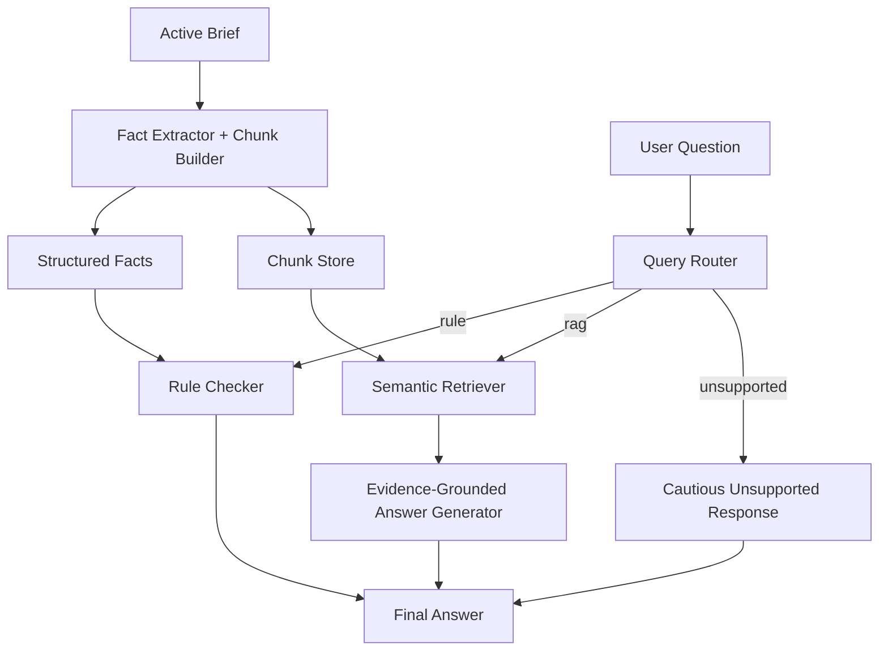
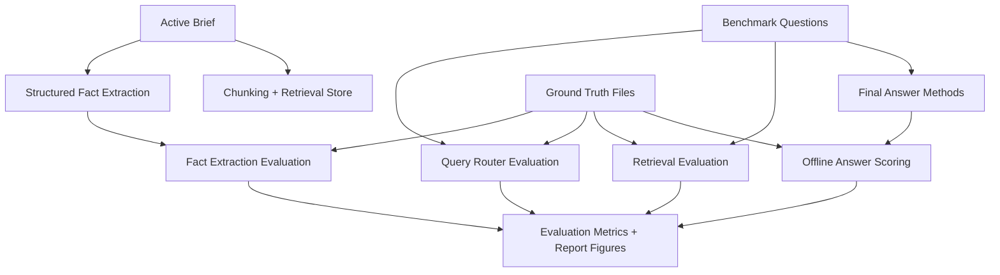

# AI-Powered Academic Document Assistant

## Overview
This repository contains a hybrid AI prototype for Assessment 3 of `36121 Artificial Intelligence Principles and Applications`.

The prototype is designed as a general single-brief academic assistant. A user provides one assignment brief at a time, the system extracts structured facts and evidence chunks from that active brief, and it then answers questions through three modes:

- `rule` for deterministic constraints and explicit requirements
- `rag` for rubric interpretation, planning, policy, and explanation questions
- `unsupported` for requests that the brief does not justify or that should not be answered confidently

The implementation combines:

- dynamic structured fact extraction from the active brief
- rule-based reasoning for deterministic constraints
- semantic retrieval for document evidence
- evidence-grounded answer generation for open-ended questions
- an evaluation pipeline that produces report-ready quantitative results and figures

The current version is intentionally shaped to support a stronger HD-level report and presentation. In addition to factual assignment questions, it covers HD-oriented rubric interpretation, workflow and story questions, evaluation design explanation, GenAI policy, and cautious handling of unsupported requests.

Assignment-policy answers in this repository must come only from the user-supplied official course documents placed in `data/raw/`. Project scaffolding files outside that runtime document set must not be treated as authoritative evidence.

## What The Prototype Can Now Support
- Exact assessment constraints such as due dates, word limits, similarity limits, file formats, filenames, presentation timing, and submission responsibilities.
- HD-oriented rubric questions for report sections and presentation criteria.
- Report-writing questions about AI methods, the system pipeline, exact-vs-open-ended answering strategy, and evaluation design.
- Presentation-framing and hallucination-reduction explanation questions grounded in the official sources and the project design document.
- GenAI and academic-integrity policy questions with cautious, document-grounded answers.
- Unsupported or unsafe questions with explicit caution rather than fabricated answers.
- Empirical evaluation artefacts for the report, including summary tables, category breakdowns, failure cases, and charts.

## Architecture
The implementation is split into clear modules:

1. `src/runtime_config.py`
   Resolves the active brief and optional supporting project sources from `data/runtime_sources.json`.
2. `src/document_loader.py`
   Reads `.txt`, `.md`, `.docx`, and text-based `.pdf` briefs into normalized plain text.
3. `src/brief_structure.py`
   Detects headings and splits the active brief into reusable sections.
4. `src/fact_extractor.py`
   Dynamically extracts structured facts such as due dates, filenames, similarity limits, rubric HD summaries, and policy guidance from the active brief, and stores per-field evidence, confidence, validation status, and extraction method metadata.
5. `src/chunking.py`
   Builds deterministic chunks and regenerates both processed assets from the configured runtime sources.
6. `src/query_router.py`
   Routes each question to `rule`, `rag`, or `unsupported`.
7. `src/rule_checker.py`
   Answers exact questions from `data/processed/structured_facts.json`.
8. `src/retrieval.py`
   Retrieves evidence chunks with embeddings, lexical overlap, and category boosts.
9. `src/answer_generator.py`
   Produces grounded answers through an OpenAI-compatible LLM when available, with deterministic fallbacks when quota or provider access is unavailable.
10. `src/baselines.py`
   Provides `Keyword Search`, `RAG-only`, and optional `LLM-only` baselines.
11. `evaluation/evaluate.py`
   Runs a four-layer evaluation suite and saves report-ready CSV files and figures.

Every function in the maintained Python modules includes English docstrings so developers can follow the architecture quickly.

## Runtime Document Collection
The runtime document boundary is strict and must stay explicit.

### Active brief configuration
The active runtime sources are defined in:

- `data/runtime_sources.json`

The key field is `brief_source`, which points to the single authoritative assignment brief for the current run. This brief must be manually provided and maintained by the user from the original official assignment brief distributed through the subject site, Canvas, or the teaching team. If the official brief changes, this file must be updated manually before the assistant is trusted again.

In the current repository snapshot, `brief_source` points to `data/raw/assessment_brief.txt`, which is a normalized transcription copied from the user-provided root file `AssignmentBrief.txt`. The runtime assistant answers from `data/raw/assessment_brief.txt`, not directly from the root file.

For assignment-brief questions, the configured `brief_source` is the only valid assignment-brief source file. Do not substitute another local note, scaffold, or project document for it.

### Active runtime sources
The live prototype currently retrieves from:

- the configured `brief_source`
- any optional `supporting_sources` listed in `data/runtime_sources.json`

`project_design.txt` is only for questions about the prototype's own design, methods, pipeline, and evaluation approach. It must not be treated as official course policy or as a substitute for the assignment brief.

Supported brief formats are:

- `.txt`
- `.md`
- `.docx`
- text-based `.pdf`

### Explicitly excluded files
The following files must not be used as runtime retrieval evidence or benchmark evidence:

- `AssignmentBrief.txt`
- `RoleAllocation.docx`
- `oral_presentation.txt`
- `report_template.txt`
- `report_rubric.txt`
- `presentation_rubric.txt`

`AssignmentBrief.txt` in the repository root is the user-provided seed source for the current transcription, but it is not the file the runtime retriever reads from. `RoleAllocation.docx` is personal project work, not an official course requirement source. The extra text files remain in the repository as legacy reference material but are intentionally excluded from current retrieval so the assistant stays grounded in a single authoritative brief.

The approved runtime sources are processed into:

- `data/processed/chunks.json`
- `data/processed/structured_facts.json`

`python src/chunking.py` rebuilds both processed files from the currently configured `brief_source` and supporting sources.

The processed chunk file currently contains `41` section-aware chunks for the current example brief configuration.

## Repository Structure
```text
data/
  raw/
  processed/
evaluation/
  evaluate.py
  fact_ground_truth.json
  question_benchmark.csv
  retrieval_ground_truth.json
  test_questions.csv
  fact_extraction_results.csv
  fact_extraction_summary.csv
  routing_results.csv
  routing_summary.csv
  retrieval_results.csv
  retrieval_summary.csv
  final_answer_results.csv
  final_answer_summary.csv
  final_answer_category_summary.csv
  failure_cases.csv
report_figures/
src/
  brief_structure.py
  app.py
  answer_generator.py
  baselines.py
  chunking.py
  document_loader.py
  fact_extractor.py
  openai_self_check.py
  query_router.py
  retrieval.py
  rule_checker.py
  runtime_config.py
README.md
requirements.txt
```

## Installation
Install dependencies with:

```powershell
python -m pip install -r requirements.txt
```

## LLM Configuration
The prototype uses an OpenAI-compatible client interface. It can work with the default OpenAI endpoint or with compatible providers such as Gemini through a custom base URL.

Create a `.env` file in the project root with:

```env
OPENAI_API_KEY=your_key_here
OPENAI_MODEL=your_model_name
OPENAI_BASE_URL=https://your-compatible-endpoint/v1
LLM_FREE_MODE=1
```

The current default local configuration uses `gemini-3.1-flash-lite-preview` through the Gemini OpenAI-compatible endpoint.

Notes:

- If `OPENAI_BASE_URL` is omitted, the code defaults to `https://api.openai.com/v1`.
- For Gemini OpenAI-compatible mode, keep the Gemini-compatible base URL and model name in `.env`.
- `LLM_FREE_MODE=1` is enabled by default for this project. When the model is a Gemini text model, the code applies a stricter request spacing than the published RPM limit to reduce the chance of `429` errors during evaluation.
- The current conservative Gemini free-mode caps are `8 RPM` for `gemini-2.5-flash-lite`, `4 RPM` for `gemini-2.5-flash`, `12 RPM` for `gemini-3.1-flash-lite` and preview variants, and `4 RPM` for `gemini-3-flash`.
- `src/app.py` prints a masked startup self-check so configuration mistakes are easier to diagnose.
- Set `OPENAI_SELF_CHECK_REMOTE=1` if you want the startup check to test live authentication as well.

## Running The Prototype
Rebuild the processed assets after changing the active brief or runtime source configuration:

```powershell
python src/chunking.py
```

If you want live LLM-assisted fact extraction during preprocessing, set:

```powershell
$env:FACT_EXTRACTION_USE_LLM="1"
```

Without that flag, the extractor still rebuilds the structured schema and evidence records, but it stays in heuristic-only mode to avoid unnecessary API usage during routine local iteration.

Run the command-line assistant:

```powershell
python src/app.py
```

Example questions:

- `When is the report due?`
- `What filename should the slides use?`
- `What does HD require in empirical analysis and results?`
- `Can we use GenAI for this assignment?`
- `Based on the brief, what workstreams should the group prioritise before submission?`
- `What AI methods are used in this project?`
- `How should the system be evaluated?`
- `Can the assistant replace official course guidance?`

## Running The Evaluation
Do not run `evaluation/evaluate.py` until the user has explicitly approved an evaluation run. The script is intentionally blocked by default because live LLM evaluation is slow and can hit provider request limits.

After explicit user approval, opt in and run:

```powershell
$env:ALLOW_EVALUATION_RUN="1"
python evaluation/evaluate.py
```

If `ALLOW_EVALUATION_RUN` is not set to `1`, the script exits immediately with a reminder instead of starting the benchmark.

The evaluation is now split into four layers:

1. `Fact Extraction Evaluation`
2. `Query Routing Evaluation`
3. `RAG Retrieval Evaluation`
4. `Final Answer Evaluation`

The evaluator supports three run modes:

- `smoke`
  No live LLM generation. Intended for quick structural checks over factual and unsupported questions.
- `core`
  Mid-sized run for day-to-day development. Includes routing, retrieval, and baseline comparisons without the optional `LLM-only` diagnostic subset.
- `report`
  Full report-ready run. Includes all four layers, all report-subset questions, and optional `LLM-only` diagnostics.

Choose a mode with:

```powershell
$env:EVALUATION_MODE="core"
```

The final-answer layer compares:

- `Keyword Search`
- `RAG-only`
- `Proposed Hybrid System`

The codebase also includes an `LLM-only` baseline implementation for a reduced diagnostic subset. It is disabled by default to keep the standard evaluation run faster and cheaper. If you want to include it, set:

```env
ENABLE_LLM_ONLY_BASELINE=1
```

`core` and `report` mode assume one live LLM-assisted fact-extraction request for the active brief. For runtime estimates, `evaluation/evaluate.py` uses:

```env
EVALUATION_REQUEST_ESTIMATE_SECONDS=8
```

When `LLM_FREE_MODE=1`, every live Gemini generation request made by the prototype or the evaluation pipeline is throttled through the same conservative rate limiter.

Evaluation responses are cached automatically in `evaluation/response_cache.json` so repeated benchmark runs do not keep re-calling the live LLM. Set `EVALUATION_REFRESH_CACHE=1` if you want to force fresh outputs.

## Current Evaluation Snapshot
The current benchmark is an example case-study benchmark for the currently configured active brief. It is now organised as a layered evaluation rather than a single flat QA sheet. In particular:

- the master benchmark bank contains `40` authored questions
- the `report` subset contains `34` questions
- the `core` subset contains `22` questions
- factual, interpretive, and unsupported questions are separated explicitly
- retrieval expectations are annotated independently through `evaluation/retrieval_ground_truth.json`
- fact extraction is scored independently through `evaluation/fact_ground_truth.json`
- live LLM outputs can be cached between runs so the benchmark can evolve without becoming too slow to iterate on

The latest explicitly approved `report` run was regenerated on `2026-05-08` with `ENABLE_LLM_ONLY_BASELINE=0`. It produced the following workload profile:

- `34` report-subset questions
- `12` interpretive questions that required hybrid RAG generation
- `47` estimated API-backed requests in total
- `6.27` estimated minutes at the default `8s` request budget
- about `7.6` minutes observed locally for the full run

The four evaluation layers now report these headline results:

- `Fact Extraction`: overall field accuracy `0.952`, missing-field rate `0.000`, evidence-support rate `1.000`, hallucinated-fact rate `0.048`
- `Routing`: overall routing accuracy `0.853`, macro-F1 `0.841`
- `Retrieval`: top-1 accuracy `0.500`, Recall@3 `0.917`, Recall@5 `0.917`, MRR `0.667`
- `Final Answer`: `Hybrid` answer accuracy `0.882`, `RAG-only` `0.735`, `Keyword Search` `0.294`

The fresh run is therefore much more credible than the earlier near-perfect legacy results. The hybrid system is clearly strongest overall, but the benchmark still exposes real weaknesses in unsupported handling and planning/story questions instead of flattening everything into a misleading `1.0`.

The current summary CSV files now reflect the latest approved run rather than older historical artefacts:

- `evaluation/fact_extraction_summary.csv`
- `evaluation/routing_summary.csv`
- `evaluation/retrieval_summary.csv`
- `evaluation/final_answer_summary.csv`
- `evaluation/final_answer_category_summary.csv`
- compatibility copies in `evaluation/summary_results.csv` and `evaluation/category_summary_results.csv`

## Evaluation Data Separation
The prototype does not read the benchmark answers during normal question answering.

- Runtime answering uses `data/processed/structured_facts.json` and `data/processed/chunks.json`.
- The fact-extraction ground truth lives in `evaluation/fact_ground_truth.json`.
- The question bank lives in `evaluation/question_benchmark.csv`.
- The retrieval evidence expectations live in `evaluation/retrieval_ground_truth.json`.
- `evaluation/evaluate.py` uses these ground-truth files only after a method has already produced its answer, in order to score extraction quality, routing quality, retrieval quality, correctness, citation support, hallucination behaviour, and unsupported handling.

This separation is important for interpreting the results correctly:

- The runtime prototype does not know the benchmark answer text in advance.
- The prototype does not load or retrieve from the evaluation ground-truth files.
- The evaluation script knows the benchmark annotations, but only as scoring references, not as retrieval evidence for the assistant.

## Ground Truth Provenance
The evaluation ground truth was manually authored from the currently configured example brief and the project design specification.

- `evaluation/fact_ground_truth.json` defines the expected structured facts for the case-study brief.
- `evaluation/question_benchmark.csv` defines factual, interpretive, and unsupported questions, their expected routes, their grading keywords, and which run modes they belong to.
- `evaluation/retrieval_ground_truth.json` defines acceptable evidence chunks for retrieval evaluation.
- Workflow, system-positioning, and evaluation-design answers are grounded in `data/raw/project_design.txt`.
- Unsupported questions are manually written as expected cautious behaviours rather than as factual document answers.
- Root-level scaffolding such as `AssignmentBrief.txt` and `RoleAllocation.docx` must never be used as runtime or benchmark evidence.

This means the benchmark is a deliberately authored case-study dataset rather than an automatically extracted dataset.

## Design Logic And Evaluation Separation
The current prototype follows a clear separation between runtime answering and offline evaluation.

### Runtime Answering Flow
1. The user configures one active assignment brief in `data/runtime_sources.json`.
2. `python src/chunking.py` reads that brief, extracts structured facts into `data/processed/structured_facts.json`, and builds evidence chunks in `data/processed/chunks.json`.
3. A user question enters the assistant.
4. `src/query_router.py` classifies the question as `rule`, `rag`, or `unsupported`.
5. If the question is `rule`, `src/rule_checker.py` answers it from the dynamically extracted structured facts.
6. If the question is `rag`, `src/retrieval.py` retrieves evidence chunks from the active brief and any supporting sources.
7. `src/answer_generator.py` then produces an evidence-grounded answer from those retrieved chunks, or falls back to a deterministic template if live LLM generation is unavailable.
8. If the question is `unsupported`, the system returns a cautious response instead of inventing an answer.



### What RAG Actually Retrieves
The RAG path retrieves from the processed chunk store built from:

- the configured active brief
- any configured supporting sources such as `project_design.txt`

The RAG path does not retrieve from:

- `AssignmentBrief.txt`
- `RoleAllocation.docx`
- the evaluation ground-truth files

### Evaluation Separation
The benchmark is evaluated offline after the assistant has already produced its answer.

1. `evaluation/evaluate.py` rebuilds the runtime assets for the active brief.
2. It first evaluates structured fact extraction against `evaluation/fact_ground_truth.json`.
3. It then evaluates the router against the expected routes in `evaluation/question_benchmark.csv`.
4. Next, it evaluates retrieval quality using `evaluation/retrieval_ground_truth.json`.
5. Finally, it sends each selected question to methods such as `Keyword Search`, `RAG-only`, `LLM-only`, or `Proposed Hybrid System`.
6. Only after an answer is produced does the script compare it with the benchmark annotations and compute final-answer metrics.



This separation means the prototype does not see benchmark answers during normal runtime, even though the evaluation script uses them later for scoring.

## Why LLM-only Hallucinates More
The `LLM-only` baseline receives only the question text. It does not receive retrieved document chunks, structured facts, or benchmark keywords.

As a result:

- it often falls back to generic academic advice instead of assignment-specific facts
- it does not know the exact due dates, filenames, slide requirements, or rubric wording
- it is more likely to produce plausible but unsupported answers

The high hallucination rate of `LLM-only` is therefore expected under this design and is one of the main reasons the hybrid system performs better on assignment-specific questions.

## Generated Report Artefacts
The evaluation script produces outputs that can be cited or adapted in the report:

- `evaluation/test_questions.csv`
- `evaluation/evaluation_workload_summary.json`
- `evaluation/fact_extraction_results.csv`
- `evaluation/fact_extraction_summary.csv`
- `evaluation/routing_results.csv`
- `evaluation/routing_summary.csv`
- `evaluation/retrieval_results.csv`
- `evaluation/retrieval_summary.csv`
- `evaluation/final_answer_results.csv`
- `evaluation/final_answer_summary.csv`
- `evaluation/final_answer_category_summary.csv`
- compatibility copies in `evaluation/evaluation_results.csv`, `evaluation/summary_results.csv`, and `evaluation/category_summary_results.csv`
- `evaluation/failure_cases.csv`
- `report_figures/method_comparison_chart.png`
- `report_figures/hallucination_rate_chart.png`
- `report_figures/category_accuracy_chart.png`

These artefacts were regenerated in the latest approved report-mode run on `2026-05-08`.

These artefacts are especially useful for:

- `Workflow and Methodology`
- `Empirical Analysis and Results`
- `Critical Reflection`

## How This Helps The Report
This version of the prototype now provides enough concrete material to support a much stronger report draft:

- The architecture is explicit and maps cleanly to a methodology section.
- The split between exact-rule answering and open-ended evidence-grounded answering is clearer and easier to justify.
- The benchmark suite now includes more realistic planning, ethics, and presentation scenarios, which makes the empirical section easier to justify.
- The generated figures and CSV summaries reduce the amount of manual reporting work.

## Important Limitations
- The benchmark is still an example case-study benchmark on one currently configured brief. High scores should be reported honestly as performance on the current controlled question set, not as broad general intelligence.
- The strongest hybrid results come from deliberate structured coverage of known question types. This is appropriate for the assignment scenario, but it should be acknowledged in the report.
- The newest benchmark still shows clear weak spots: hybrid unsupported accuracy is `0.667`, planning/story accuracy is `0.500`, and routing still misclassifies some factual policy questions as `rag`.
- The optional `LLM-only` diagnostic subset depends on live provider availability, API billing configuration, and quota.
- `core` and `report` mode assume one live fact-extraction request for the active brief, which should be counted when estimating runtime and API cost.
- The current ingestion pipeline supports plain text, markdown, DOCX, and text-based PDF briefs. Scanned-image OCR is still future work.
- The assistant should support document understanding, not replace tutors, lecturers, or official course instructions.

## Future Work
- Strengthen the generic fact extractor so it handles more diverse brief layouts with fewer heuristics.
- Add OCR or multimodal support for image-heavy or scanned documents.
- Validate the general single-brief pipeline on additional unseen assignment briefs after the core architecture is stable.
- Expand the evaluation suite with more adversarial and paraphrased questions.
- Provide a lightweight web interface for demonstrations.
